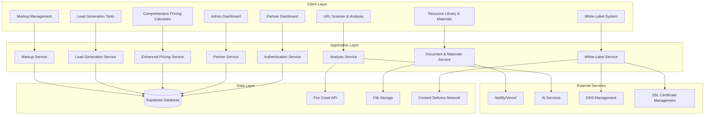

# Partner Portal Design Document

## Overview

The Partner Portal is a comprehensive web application that extends the existing React/TypeScript website to provide partners with self-service access to the complete service portfolio, professional sales materials, and advanced white-label capabilities. The system integrates seamlessly with the current Supabase backend while introducing new partner-specific features including comprehensive service pricing across websites, web applications, mobile apps, AI-built websites, e-commerce solutions, and maintenance packages.

The portal addresses the critical business need to reduce manual pricing requests while empowering partners with professional, branded materials and tools they need to effectively resell services. Key innovations include flexible URL structure options (from simple paths to full custom domains), comprehensive white-label branding capabilities, markup management tools with best practices guidance, and lead generation features that help partners grow their business.

By leveraging existing infrastructure and modern web technologies, the solution provides a scalable foundation for partner relationship management while maintaining the simplicity and performance characteristics of the main website.

## Architecture

### High-Level Architecture



### Technology Stack

- **Frontend**: React 18+ with TypeScript
- **Backend**: Supabase (PostgreSQL, Auth, Storage, Edge Functions)
- **Deployment**: Netlify or Vercel with custom domain support
- **External APIs**: Fire Crawl for website analysis
- **Styling**: Tailwind CSS (consistent with existing site)
- **State Management**: React Query for server state, Zustand for client state
- **Authentication**: Supabase Auth with partner role extensions
- **File Processing**: PDF generation, document templating
- **DNS Management**: Cloudflare or similar for custom domain routing
- **CDN**: Global content delivery for white-label assets
- **Email**: Transactional email service for notifications and templates

## Components and Interfaces

### Core Components

#### 1. Partner Authentication System

**Purpose**: Extends existing authentication to support partner-specific access control

**Interface**:
```typescript
interface PartnerAuthService {
  loginPartner(credentials: LoginCredentials): Promise<PartnerSession>
  validatePartnerAccess(userId: string): Promise<PartnerProfile>
  refreshPartnerSession(token: string): Promise<PartnerSession>
  logoutPartner(): Promise<void>
}

interface PartnerProfile {
  id: string
  companyName: string
  contactEmail: string
  discountTier: DiscountTier
  status: 'active' | 'inactive' | 'pending'
  permissions: PartnerPermission[]
}

interface DiscountTier {
  name: string
  websiteDiscount: number
  appDiscount: number
  aiWebsiteBaseDiscount: number
  perPageDiscount: number
}
```

#### 2. Comprehensive Pricing Calculator Component

**Purpose**: Provides partner-specific pricing calculations across the complete service portfolio with markup management

**Interface**:
```typescript
interface ComprehensivePricingCalculator {
  calculateCustomWebsitePrice(specs: CustomWebsiteSpecs, partnerId: string): Promise<PriceQuote>
  calculateWebApplicationPrice(specs: WebAppSpecs, partnerId: string): Promise<PriceQuote>
  calculateMobileAppPrice(specs: MobileAppSpecs, partnerId: string): Promise<PriceQuote>
  calculateAIWebsitePrice(specs: AIWebsiteSpecs, partnerId: string): Promise<PriceQuote>
  calculateEcommercePrice(specs: EcommerceSpecs, partnerId: string): Promise<PriceQuote>
  calculateMaintenancePrice(specs: MaintenanceSpecs, partnerId: string): Promise<PriceQuote>
  applyPartnerMarkup(basePrice: number, markupSettings: MarkupSettings): PricingBreakdown
  saveQuote(quote: PriceQuote): Promise<string>
  exportQuote(quoteId: string, format: 'pdf' | 'email'): Promise<ExportResult>
}

interface CustomWebsiteSpecs {
  complexity: 'simple' | 'business' | 'complex'
  pageCount: number
  features: WebsiteFeature[]
  cmsRequired: boolean
  ecommerceIntegration: boolean
  customIntegrations: string[]
  timeline: string
}

interface WebAppSpecs {
  userAuthentication: boolean
  databaseComplexity: 'simple' | 'moderate' | 'complex'
  apiIntegrations: string[]
  customFunctionality: string[]
  userBase: 'small' | 'medium' | 'large'
  realTimeFeatures: boolean
}

interface MobileAppSpecs {
  platforms: ('ios' | 'android' | 'cross-platform')[]
  features: MobileFeature[]
  backendRequired: boolean
  appStoreDeployment: boolean
  pushNotifications: boolean
  offlineCapability: boolean
}

interface EcommerceSpecs {
  productCatalogSize: 'small' | 'medium' | 'large'
  paymentProcessing: string[]
  inventoryManagement: boolean
  thirdPartyIntegrations: string[]
  multiCurrency: boolean
  subscriptionSupport: boolean
}

interface MaintenanceSpecs {
  hostingTier: 'basic' | 'professional' | 'enterprise'
  securityUpdates: boolean
  contentUpdates: boolean
  technicalSupport: 'basic' | 'priority' | '24/7'
  performanceMonitoring: boolean
  backupFrequency: 'daily' | 'weekly' | 'monthly'
}

interface MarkupSettings {
  defaultMarkupPercentage: number
  serviceSpecificMarkups: Record<ServiceType, number>
  volumeDiscounts: VolumeDiscount[]
  competitivePositioning: 'budget' | 'value' | 'premium'
}

interface PricingBreakdown {
  partnerCost: number
  suggestedRetailPrice: number
  partnerProfit: number
  profitMargin: number
  competitiveAnalysis: CompetitiveComparison[]
}
```

#### 3. URL Scanner and Analysis

**Purpose**: Analyzes existing websites and provides rebuild recommendations

**Interface**:
```typescript
interface URLScanner {
  scanWebsite(url: string): Promise<WebsiteAnalysis>
  generateRebuildSuggestions(analysis: WebsiteAnalysis): Promise<RebuildSuggestions>
  calculateRebuildPrice(suggestions: RebuildSuggestions, partnerId: string): Promise<PriceQuote>
}

interface WebsiteAnalysis {
  url: string
  pageCount: number
  technologies: string[]
  contentTypes: ContentType[]
  performanceMetrics: PerformanceMetrics
  seoAnalysis: SEOAnalysis
  accessibility: AccessibilityScore
}

interface RebuildSuggestions {
  recommendedApproach: 'full-rebuild' | 'migration' | 'enhancement'
  estimatedPages: number
  suggestedFeatures: Feature[]
  bestPractices: string[]
  timelineEstimate: string
}
```

#### 4. Comprehensive Resource Library System

**Purpose**: Manages and customizes extensive documentation, sales materials, and client-ready resources

**Interface**:
```typescript
interface ComprehensiveResourceLibrary {
  // Technical Materials
  getTechnicalDocuments(partnerId: string): Promise<TechnicalResource[]>
  getSalesMarketingMaterials(partnerId: string): Promise<SalesResource[]>
  getClientReadyMaterials(partnerId: string): Promise<ClientResource[]>
  getTrainingMaterials(partnerId: string): Promise<TrainingResource[]>
  
  // Customization and White-Labeling
  customizeResource(resourceId: string, branding: ComprehensiveBranding): Promise<CustomResource>
  generateWhiteLabelVersion(resourceId: string, brandingLevel: BrandingLevel): Promise<WhiteLabelResource>
  
  // Resource Management
  downloadResource(resourceId: string, format: 'pdf' | 'docx' | 'pptx'): Promise<Blob>
  searchResources(query: string, category?: ResourceCategory): Promise<Resource[]>
  getResourceUpdates(partnerId: string): Promise<ResourceUpdate[]>
}

interface TechnicalResource {
  id: string
  title: string
  category: 'specifications' | 'security' | 'hosting' | 'technology'
  content: string
  lastUpdated: Date
  customizable: boolean
  whitelabelable: boolean
}

interface SalesResource {
  id: string
  title: string
  category: 'comparisons' | 'case-studies' | 'roi-calculators' | 'competitive-analysis'
  content: string
  interactiveElements: boolean
  customizable: boolean
}

interface ClientResource {
  id: string
  title: string
  category: 'proposals' | 'sow-templates' | 'requirement-forms' | 'timelines'
  template: boolean
  fillableFields: string[]
  brandingRequired: boolean
}

interface ComprehensiveBranding {
  logo: string
  companyName: string
  colors: BrandColors
  fonts: BrandFonts
  contactInfo: ContactInfo
  socialMedia: SocialMediaLinks
  customDomain?: string
  brandingLevel: BrandingLevel
}

type BrandingLevel = 'co-branded' | 'partner-primary' | 'full-white-label'
```

#### 5. Partner Dashboard

**Purpose**: Central hub for partner activities and navigation

**Interface**:
```typescript
interface PartnerDashboard {
  getDashboardData(partnerId: string): Promise<DashboardData>
  getRecentActivity(partnerId: string): Promise<Activity[]>
  getQuickActions(): Promise<QuickAction[]>
}

interface DashboardData {
  partner: PartnerProfile
  recentQuotes: PriceQuote[]
  notifications: Notification[]
  usageStats: UsageStats
  availableFeatures: Feature[]
}
```

#### 7. White-Label System and Domain Management

**Purpose**: Provides comprehensive white-label capabilities including custom domain support

**Interface**:
```typescript
interface WhiteLabelSystem {
  configureDomain(partnerId: string, domainConfig: DomainConfiguration): Promise<DomainSetup>
  validateCustomDomain(domain: string): Promise<DomainValidation>
  setupSSLCertificate(domain: string): Promise<SSLSetup>
  applyBranding(partnerId: string, branding: ComprehensiveBranding): Promise<BrandingResult>
  generateBrandedAssets(branding: ComprehensiveBranding): Promise<BrandedAssets>
  testWhiteLabelSetup(partnerId: string): Promise<SetupValidation>
}

interface DomainConfiguration {
  type: 'subdomain' | 'custom-domain' | 'partner-path'
  domain?: string
  subdomain?: string
  sslRequired: boolean
  redirects: DomainRedirect[]
}

interface BrandedAssets {
  logo: string
  favicon: string
  brandedTemplates: Template[]
  customCSS: string
  emailTemplates: EmailTemplate[]
}
```

#### 8. Lead Generation and CRM System

**Purpose**: Provides lead qualification, client management, and project tracking capabilities

**Interface**:
```typescript
interface LeadGenerationSystem {
  createQualificationForm(partnerId: string, formConfig: FormConfiguration): Promise<QualificationForm>
  processQualificationResponse(formId: string, responses: FormResponse[]): Promise<LeadAssessment>
  generatePreliminaryEstimate(assessment: LeadAssessment): Promise<PreliminaryQuote>
  createClientProfile(partnerId: string, clientData: ClientData): Promise<ClientProfile>
  trackClientCommunication(clientId: string, communication: Communication): Promise<void>
  generateProjectStatusPage(projectId: string, branding: ComprehensiveBranding): Promise<StatusPage>
}

interface QualificationForm {
  id: string
  partnerId: string
  questions: FormQuestion[]
  branding: ComprehensiveBranding
  publicUrl: string
  embedCode: string
}

interface LeadAssessment {
  leadScore: number
  serviceRecommendations: ServiceRecommendation[]
  estimatedBudget: BudgetRange
  timelineEstimate: string
  complexityLevel: 'simple' | 'moderate' | 'complex'
}

interface ClientProfile {
  id: string
  partnerId: string
  companyName: string
  contactInfo: ContactInfo
  projectHistory: Project[]
  communicationLog: Communication[]
  preferences: ClientPreferences
}
```

#### 9. Markup Management and Pricing Strategy System

**Purpose**: Provides markup calculation tools and best practices guidance for competitive pricing

**Interface**:
```typescript
interface MarkupManagementSystem {
  calculateMarkupScenarios(basePrice: number, scenarios: MarkupScenario[]): Promise<MarkupAnalysis[]>
  getBestPracticesGuidance(serviceType: ServiceType, marketSegment: MarketSegment): Promise<PricingGuidance>
  analyzeCompetitivePositioning(pricing: PricingStructure, market: MarketData): Promise<CompetitiveAnalysis>
  generatePricingTemplates(partnerId: string, markupSettings: MarkupSettings): Promise<PricingTemplate[]>
  saveMarkupPreferences(partnerId: string, preferences: MarkupPreferences): Promise<void>
  getMarketBenchmarks(serviceType: ServiceType, region?: string): Promise<MarketBenchmarks>
}

interface MarkupScenario {
  name: string
  markupPercentage: number
  targetMarket: 'budget' | 'value' | 'premium'
  competitiveFactors: string[]
}

interface MarkupAnalysis {
  scenario: MarkupScenario
  finalPrice: number
  profitMargin: number
  marketPosition: MarketPosition
  competitiveAdvantage: string[]
  risks: string[]
}

interface PricingGuidance {
  recommendedMarkupRange: [number, number]
  marketPositioning: string
  valuePropositionTips: string[]
  objectionHandling: ObjectionResponse[]
  competitiveDifferentiators: string[]
}

interface MarketBenchmarks {
  averageMarketPrice: number
  priceRange: [number, number]
  competitorPricing: CompetitorPrice[]
  marketTrends: MarketTrend[]
}
```

#### 10. Enhanced Admin Management System

**Purpose**: Administrative interface for managing partners, pricing, and portal configuration

**Interface**:
```typescript
interface EnhancedAdminService {
  createPartner(partnerData: CreatePartnerRequest): Promise<PartnerProfile>
  updatePartnerPricing(partnerId: string, pricing: CustomPricing): Promise<void>
  configureWhiteLabelSettings(partnerId: string, settings: WhiteLabelSettings): Promise<void>
  getPartnerActivity(partnerId: string): Promise<PartnerActivity[]>
  managePartnerStatus(partnerId: string, status: PartnerStatus): Promise<void>
  getSystemAnalytics(): Promise<SystemAnalytics>
  manageResourceLibrary(action: ResourceAction, resource: Resource): Promise<void>
}

interface WhiteLabelSettings {
  allowedBrandingLevels: BrandingLevel[]
  customDomainEnabled: boolean
  sslCertificateManagement: boolean
  brandingRestrictions: BrandingRestriction[]
}

interface SystemAnalytics {
  totalPartners: number
  activePartners: number
  quotesGenerated: number
  resourceDownloads: number
  topPerformingPartners: PartnerPerformance[]
  systemUsageMetrics: UsageMetric[]
}
```

## Data Models

### Database Schema Extensions

```sql
-- Enhanced partner profiles table
CREATE TABLE partner_profiles (
  id UUID PRIMARY KEY REFERENCES auth.users(id),
  company_name TEXT NOT NULL,
  contact_email TEXT NOT NULL,
  discount_tier_id UUID REFERENCES discount_tiers(id),
  status partner_status DEFAULT 'pending',
  white_label_settings JSONB DEFAULT '{}',
  markup_preferences JSONB DEFAULT '{}',
  custom_domain TEXT,
  branding_level branding_level DEFAULT 'co-branded',
  created_at TIMESTAMP WITH TIME ZONE DEFAULT NOW(),
  updated_at TIMESTAMP WITH TIME ZONE DEFAULT NOW()
);

-- Enhanced discount tiers table
CREATE TABLE discount_tiers (
  id UUID PRIMARY KEY DEFAULT gen_random_uuid(),
  name TEXT NOT NULL,
  website_discount DECIMAL(5,2),
  webapp_discount DECIMAL(5,2),
  mobile_app_discount DECIMAL(5,2),
  ai_website_base_discount DECIMAL(5,2),
  ecommerce_discount DECIMAL(5,2),
  maintenance_discount DECIMAL(5,2),
  per_page_discount DECIMAL(5,2),
  created_at TIMESTAMP WITH TIME ZONE DEFAULT NOW()
);

-- Enhanced price quotes table
CREATE TABLE price_quotes (
  id UUID PRIMARY KEY DEFAULT gen_random_uuid(),
  partner_id UUID REFERENCES partner_profiles(id),
  service_type service_type NOT NULL,
  partner_cost DECIMAL(10,2),
  suggested_retail_price DECIMAL(10,2),
  markup_percentage DECIMAL(5,2),
  specifications JSONB,
  competitive_analysis JSONB,
  expires_at TIMESTAMP WITH TIME ZONE,
  created_at TIMESTAMP WITH TIME ZONE DEFAULT NOW()
);

-- Lead generation tables
CREATE TABLE qualification_forms (
  id UUID PRIMARY KEY DEFAULT gen_random_uuid(),
  partner_id UUID REFERENCES partner_profiles(id),
  form_config JSONB,
  public_url TEXT,
  embed_code TEXT,
  created_at TIMESTAMP WITH TIME ZONE DEFAULT NOW()
);

CREATE TABLE lead_assessments (
  id UUID PRIMARY KEY DEFAULT gen_random_uuid(),
  form_id UUID REFERENCES qualification_forms(id),
  responses JSONB,
  lead_score INTEGER,
  service_recommendations JSONB,
  created_at TIMESTAMP WITH TIME ZONE DEFAULT NOW()
);

CREATE TABLE client_profiles (
  id UUID PRIMARY KEY DEFAULT gen_random_uuid(),
  partner_id UUID REFERENCES partner_profiles(id),
  company_name TEXT,
  contact_info JSONB,
  project_history JSONB DEFAULT '[]',
  communication_log JSONB DEFAULT '[]',
  preferences JSONB DEFAULT '{}',
  created_at TIMESTAMP WITH TIME ZONE DEFAULT NOW()
);

-- Resource library tables
CREATE TABLE resource_categories (
  id UUID PRIMARY KEY DEFAULT gen_random_uuid(),
  name TEXT NOT NULL,
  description TEXT,
  parent_category_id UUID REFERENCES resource_categories(id)
);

CREATE TABLE resources (
  id UUID PRIMARY KEY DEFAULT gen_random_uuid(),
  title TEXT NOT NULL,
  category_id UUID REFERENCES resource_categories(id),
  content_type TEXT,
  file_path TEXT,
  customizable BOOLEAN DEFAULT false,
  white_labelable BOOLEAN DEFAULT false,
  version INTEGER DEFAULT 1,
  created_at TIMESTAMP WITH TIME ZONE DEFAULT NOW(),
  updated_at TIMESTAMP WITH TIME ZONE DEFAULT NOW()
);

CREATE TABLE custom_resources (
  id UUID PRIMARY KEY DEFAULT gen_random_uuid(),
  partner_id UUID REFERENCES partner_profiles(id),
  base_resource_id UUID REFERENCES resources(id),
  customized_content JSONB,
  branding_data JSONB,
  white_label_level branding_level,
  created_at TIMESTAMP WITH TIME ZONE DEFAULT NOW()
);

-- White-label domain management
CREATE TABLE partner_domains (
  id UUID PRIMARY KEY DEFAULT gen_random_uuid(),
  partner_id UUID REFERENCES partner_profiles(id),
  domain_type domain_type,
  domain_name TEXT,
  ssl_certificate_id TEXT,
  dns_configured BOOLEAN DEFAULT false,
  status domain_status DEFAULT 'pending',
  created_at TIMESTAMP WITH TIME ZONE DEFAULT NOW()
);

-- Analytics and tracking
CREATE TABLE partner_analytics (
  id UUID PRIMARY KEY DEFAULT gen_random_uuid(),
  partner_id UUID REFERENCES partner_profiles(id),
  metric_type TEXT,
  metric_value DECIMAL(10,2),
  metadata JSONB,
  recorded_at TIMESTAMP WITH TIME ZONE DEFAULT NOW()
);
```

### Enhanced Type Definitions

```typescript
type ServiceType = 'custom-website' | 'web-application' | 'mobile-app' | 'ai-website' | 'ecommerce' | 'maintenance'
type PartnerStatus = 'active' | 'inactive' | 'pending' | 'suspended'
type BrandingLevel = 'co-branded' | 'partner-primary' | 'full-white-label'
type DomainType = 'subdomain' | 'custom-domain' | 'partner-path'
type DomainStatus = 'pending' | 'configuring' | 'active' | 'failed'

interface CustomWebsiteSpecs {
  complexity: 'simple' | 'business' | 'complex'
  pageCount: number
  features: WebsiteFeature[]
  cmsRequired: boolean
  ecommerceIntegration: boolean
  customIntegrations: string[]
  timeline: string
}

interface WebAppSpecs {
  userAuthentication: boolean
  databaseComplexity: 'simple' | 'moderate' | 'complex'
  apiIntegrations: string[]
  customFunctionality: string[]
  userBase: 'small' | 'medium' | 'large'
  realTimeFeatures: boolean
}

interface MobileAppSpecs {
  platforms: ('ios' | 'android' | 'cross-platform')[]
  features: MobileFeature[]
  backendRequired: boolean
  appStoreDeployment: boolean
  pushNotifications: boolean
  offlineCapability: boolean
}

interface ComprehensiveBranding {
  logo: string
  companyName: string
  colors: BrandColors
  fonts: BrandFonts
  contactInfo: ContactInfo
  socialMedia: SocialMediaLinks
  customDomain?: string
  brandingLevel: BrandingLevel
}

interface MarkupPreferences {
  defaultMarkupPercentage: number
  serviceSpecificMarkups: Record<ServiceType, number>
  competitivePositioning: 'budget' | 'value' | 'premium'
  autoApplyBestPractices: boolean
}
```
## Correctness Properties

*A property is a characteristic or behavior that should hold true across all valid executions of a system—essentially, a formal statement about what the system should do. Properties serve as the bridge between human-readable specifications and machine-verifiable correctness guarantees.*

Based on the prework analysis and property reflection, I've consolidated related criteria into comprehensive properties that eliminate redundancy while ensuring complete coverage:

### Core Properties

**Property 1: Authentication and Session Management**
*For any* partner credentials and session state, the authentication system should correctly grant access for valid credentials, deny access for invalid credentials with appropriate error messages, and redirect expired sessions to login while maintaining integration with existing authentication infrastructure
**Validates: Requirements 1.1, 1.2, 1.3**

**Property 2: Partner-Specific Content Personalization**
*For any* partner with specific discount tiers, account status, and profile information, the portal should display personalized content including dashboard summaries, discount tier information, contact details, and agreement terms consistently across all portal sections
**Validates: Requirements 1.5, 4.4, 5.1, 5.3, 5.5**

**Property 3: Comprehensive Service Pricing with Discount Application**
*For any* service type (custom websites, web applications, mobile apps, AI websites, e-commerce, maintenance) and partner discount tier, the pricing calculator should apply discounts consistently and show both standard and partner pricing accurately
**Validates: Requirements 2.3, 2.8**

**Property 4: Quote Lifecycle Management**
*For any* pricing calculation and partner branding configuration, the system should generate properly formatted quotes, allow template customization with partner branding, provide export capabilities in multiple formats, store quote history, and include required partner contact information and terms
**Validates: Requirements 2.9, 7.1, 7.2, 7.3, 7.4, 7.5**

**Property 5: Resource Library Management and Customization**
*For any* resource document and partner branding information, the system should allow customization with partner branding, generate white-label versions, organize materials with search and filtering capabilities, provide download options in multiple formats, and notify partners of material updates
**Validates: Requirements 3.5, 3.6, 3.7, 3.8, 3.9**

**Property 6: Navigation and Dashboard Consistency**
*For any* partner navigation sequence between portal sections, the system should maintain consistent navigation, branding, and functionality while highlighting new features when available
**Validates: Requirements 4.3, 4.5**

**Property 7: Profile Management and Updates**
*For any* partner profile update, the system should save changes, provide confirmation, and reflect updates consistently across all portal sections
**Validates: Requirements 5.2**

**Property 8: Onboarding Progress Tracking**
*For any* partner completing onboarding steps, the system should track progress accurately and provide completion status
**Validates: Requirements 8.5**

**Property 9: Website Analysis and Pricing Recommendations**
*For any* valid website URL, the scanner should crawl the site using Fire Crawl, provide accurate page count and content assessment, generate appropriate pricing recommendations based on complexity, suggest best practices, and allow quote generation from analysis results
**Validates: Requirements 9.1, 9.2, 9.3, 9.4, 9.5**

**Property 10: URL Structure and White-Label Domain Management**
*For any* partner access method (dedicated path, custom subdomain, or custom domain), the portal should maintain consistent functionality while applying appropriate branding configuration and hiding original company branding when white-label mode is enabled
**Validates: Requirements 10.2, 10.3, 10.4, 10.5**

**Property 11: Comprehensive White-Label Branding System**
*For any* partner branding configuration and white-label level (co-branded, partner-primary, full white-label), the system should allow upload and configuration of custom branding elements, replace original branding appropriately, generate branded proposals and documentation, and maintain partner branding throughout client experiences
**Validates: Requirements 11.1, 11.2, 11.3, 11.4, 11.5**

**Property 12: Analytics and Business Intelligence**
*For any* partner's portal usage data, the dashboard should display comprehensive analytics including quote generation frequency, client engagement metrics, trending services, conversion rates, and provide exportable reports while tracking client interactions with partner-branded materials
**Validates: Requirements 12.1, 12.2, 12.3, 12.4, 12.5**

**Property 13: Administrative Partner Management**
*For any* partner account and administrative action, administrators should be able to create and manage partner accounts, configure custom discount tiers and pricing structures, view partner activity and quote generation, and update pricing structures when needed
**Validates: Requirements 13.1, 13.2, 13.3, 13.4**

**Property 14: Lead Generation and Client Management**
*For any* partner and client interaction, the system should provide lead qualification forms, automatically generate preliminary estimates from form completions, offer CRM-lite functionality for tracking leads and communications, store client profiles securely, generate client-facing project status pages with partner branding, and provide referral tracking capabilities
**Validates: Requirements 14.1, 14.2, 14.3, 14.4, 14.6, 14.7, 14.8**

**Property 15: ROI and Competitive Analysis Tools**
*For any* input data and comparison scenarios, the ROI calculators should show accurate cost savings and revenue impact calculations, and comparison tools should provide feature-by-feature and pricing comparisons with market alternatives
**Validates: Requirements 15.5, 15.6**

**Property 16: Markup Management and Pricing Strategy**
*For any* markup scenario and partner preferences, the system should provide accurate markup calculations showing partner cost and suggested retail pricing, display markup scenarios with profitability analysis, provide competitive analysis at different markup levels, and save/apply markup preferences consistently across all pricing calculations
**Validates: Requirements 16.1, 16.3, 16.7, 16.8**

## Error Handling

### Authentication and Access Errors
- **Invalid Credentials**: Display clear error messages without revealing system details
- **Session Expiration**: Graceful redirect to login with session restoration after re-authentication
- **Permission Denied**: Informative messages when partners attempt unauthorized actions
- **White-Label Domain Issues**: Clear guidance for DNS configuration and SSL certificate problems
- **Network Failures**: Retry mechanisms with exponential backoff for authentication requests

### Comprehensive Pricing Calculator Errors
- **Invalid Service Specifications**: Real-time validation with helpful error messages for all service types
- **Markup Calculation Failures**: Fallback to default markup settings with error logging
- **Discount Application Errors**: Graceful degradation with standard pricing when discount calculation fails
- **Quote Generation Errors**: Alternative quote formats and manual quote option when automated generation fails
- **Export Failures**: Multiple export format options and retry mechanisms

### Resource Library and White-Label Errors
- **Document Customization Failures**: Preserve original documents when branding application fails
- **White-Label Asset Generation**: Fallback to standard branding when custom branding fails
- **Download Errors**: Alternative formats and retry mechanisms for document downloads
- **Storage Issues**: Temporary storage with cleanup for failed customization attempts
- **Version Conflicts**: Conflict resolution for simultaneous document updates
- **Branding Upload Failures**: Clear validation messages for unsupported file formats or sizes

### URL Scanner and Analysis Errors
- **Invalid URLs**: Clear validation messages for malformed or inaccessible URLs
- **Fire Crawl API Failures**: Timeout handling and partial analysis when crawling encounters issues
- **Analysis Processing Errors**: Fallback to manual analysis workflow when automated analysis fails
- **Rate Limiting**: Queue management and user notification for API rate limits
- **Large Website Handling**: Progressive analysis with user notification for very large sites

### Lead Generation and CRM Errors
- **Form Submission Failures**: Data preservation and retry mechanisms for qualification forms
- **Client Profile Creation Errors**: Validation messages and data recovery for profile creation
- **Communication Logging Failures**: Backup storage and sync recovery for communication logs
- **Project Status Page Errors**: Fallback to basic status display when advanced features fail
- **Email Template Failures**: Alternative templates and manual email options

### Domain and Infrastructure Errors
- **Custom Domain Configuration**: Step-by-step guidance for DNS and SSL setup issues
- **CDN Failures**: Fallback to direct asset serving when CDN is unavailable
- **SSL Certificate Issues**: Automatic renewal and manual certificate upload options
- **Subdomain Conflicts**: Alternative subdomain suggestions and conflict resolution
- **Performance Degradation**: Graceful degradation with core functionality preservation

### Data Persistence and Sync Errors
- **Database Failures**: Transaction rollback with user notification and retry options
- **Storage Limits**: Quota management with cleanup of old quotes and analyses
- **Sync Issues**: Conflict resolution for concurrent partner profile updates
- **Backup Failures**: Multiple storage backends for critical partner data
- **Analytics Data Loss**: Data recovery mechanisms and alternative metrics sources

## Testing Strategy

### Dual Testing Approach

The testing strategy employs both unit testing and property-based testing to ensure comprehensive coverage across the expanded partner portal functionality:

**Unit Tests**: Focus on specific examples, edge cases, and integration points
- Authentication flow examples with specific credential combinations
- Service pricing calculations for known project specifications across all service types
- Document customization with sample branding configurations
- White-label branding application with specific branding levels
- Lead qualification form processing with sample responses
- URL scanner analysis with known website structures
- Markup calculation with specific percentage scenarios
- Error handling scenarios with specific failure conditions
- Integration tests between components and external services

**Property-Based Tests**: Verify universal properties across all inputs
- Generate random partner profiles with various tiers and verify personalization consistency
- Test comprehensive pricing calculations with randomized specifications across all service types
- Validate document customization with diverse branding combinations and white-label levels
- Test URL scanner with various website structures and content types
- Verify quote generation and lifecycle management across different service combinations
- Test lead generation workflows with randomized form responses and client data
- Validate markup calculations with random percentage ranges and competitive scenarios
- Test white-label domain configuration with various domain types and branding levels
- Verify analytics tracking with randomized usage patterns and engagement data

### Property-Based Testing Configuration

**Testing Library**: Use `fast-check` for TypeScript property-based testing
**Test Configuration**: Minimum 100 iterations per property test
**Test Tagging**: Each property test references its design document property

Example test tags:
- **Feature: partner-portal, Property 1: Authentication and Session Management**
- **Feature: partner-portal, Property 3: Comprehensive Service Pricing with Discount Application**
- **Feature: partner-portal, Property 11: Comprehensive White-Label Branding System**
- **Feature: partner-portal, Property 14: Lead Generation and Client Management**

### Testing Coverage Requirements

**Unit Test Coverage**:
- Component rendering and user interactions across all portal sections
- API integration points and error responses for all external services
- Database operations and data validation for all entity types
- File upload, processing, and download functionality
- Authentication and authorization flows including white-label domain access
- Branding application and white-label asset generation
- Email template processing and notification systems

**Property Test Coverage**:
- All 16 correctness properties must be implemented as property-based tests
- Each test must run minimum 100 iterations with comprehensive input generation
- Random data generation for partners, service specifications, branding configurations, and client data
- Comprehensive input space exploration for pricing, analysis, and markup functions
- White-label domain and branding scenario testing
- Lead generation and CRM workflow validation

**Integration Test Coverage**:
- End-to-end partner workflows from registration through quote generation and client management
- Admin workflows for partner management, pricing configuration, and system analytics
- Cross-component data flow and state management across all portal sections
- External API integration (Fire Crawl, Supabase, DNS management, SSL certificates)
- File storage, CDN, and asset delivery operations
- White-label domain configuration and branding application workflows
- Email delivery and notification systems

### Test Data Management

**Partner Test Data**:
- Multiple discount tiers with varying rates across all service types
- Diverse company profiles and comprehensive branding configurations
- Various account statuses, permission levels, and white-label settings
- Custom domain configurations and SSL certificate scenarios

**Service Pricing Test Data**:
- Comprehensive project specifications across all service types (custom websites, web apps, mobile apps, AI websites, e-commerce, maintenance)
- Edge cases for page counts, feature combinations, and complexity levels
- Boundary conditions for discount calculations and markup applications
- Competitive analysis scenarios with various market positioning strategies

**Resource Library Test Data**:
- Sample documents across all categories (technical, sales, client-ready, training)
- Various branding configurations and white-label levels
- Multiple file formats and customization scenarios
- Version control and update notification scenarios

**Lead Generation Test Data**:
- Diverse qualification form configurations and response patterns
- Client profile data with various company sizes and project requirements
- Communication logs and project status tracking scenarios
- Referral tracking and conversion analysis data

**White-Label Test Data**:
- Various domain types (subdomains, custom domains, partner paths)
- Different branding levels and asset configurations
- SSL certificate and DNS configuration scenarios
- CDN and asset delivery testing scenarios

The testing strategy ensures that both specific scenarios and general system behavior are thoroughly validated across the comprehensive partner portal functionality, providing confidence in the system's reliability, correctness, and scalability.